# Projet DevOps · velos-api

**Nom et prénom :** Souleymane DJIBO
**Groupe :** M2DAN26.1
**Dépôt :** https://github.com/Souleymane-pmn/velos-api
**Image publiée :** docker.io/souley123/velos-api (tags `1.0`, `2.0`, `latest`, et les tags numériques produits par chaque exécution Jenkins, ex. `9`)
**Date de rendu :** 28/08/2026

---

## 1. Ce que j'ai construit, en cinq lignes

`velos-api` est une petite API Flask qui expose l'état de stations de vélos en libre-service (stations, disponibilité, alertes). Le code fourni est versionné sur GitHub avec un historique de branches, conflits et pull requests. Il est conteneurisé avec une image multi-étages sans privilèges, associée à une base PostgreSQL via `docker compose`. L'ensemble est ensuite déployé dans un cluster Kubernetes local avec deux exemplaires de l'API et une base persistante. Enfin, un pipeline Jenkins déclenché automatiquement teste, construit, publie et déploie chaque nouvelle version, en refusant la publication si les tests échouent.

## 2. Le trajet d'une requête

Navigateur → port `8081` de ma machine → `extraPortMapping` du cluster `kind` (mappé sur le port `30081` du nœud `control-plane`) → Service Kubernetes `velos-api` de type `NodePort` → sélection des pods par l'étiquette `app: velos-api` → conteneur Flask sur le port `8000` → lecture de `DATABASE_URL` (fournie par le secret `velos-secret`) → Service Kubernetes `velos-db` (ClusterIP), résolu par le DNS interne du cluster → pod PostgreSQL sur le port `5432` → requête SQL sur la table `stations` → réponse JSON qui remonte toute la chaîne jusqu'au navigateur.

---

## 3. Jalon 1 · Git

**Ce que j'ai fait :** dépôt `velos-api` créé sur GitHub puis cloné en local, `.gitignore` posé dès le premier commit, code fourni versionné, travail mené sur des branches nommées (`setup`, `ajuste-seuil-bas`, `alertes`, `kubernetes`, `jenkins`, `rouge-utile`, `reparation`, `captures`), chacune fusionnée via une pull request avec au moins un commentaire de revue avant fusion. Un tag `v1.0.0` a été posé sur la version conteneurisée, et une règle de protection interdit tout envoi direct sur `main`.

**Le conflit :** provoqué volontairement sur `README.md`, à la ligne décrivant le seuil d'alerte de la route `/alertes`. Deux décisions plausibles s'affrontaient : une branche proposait un seuil strict à 1 vélo, l'autre (poussée directement sur `main`) proposait un seuil élargi à 3 vélos pour anticiper les pannes. En fusionnant `main` dans la branche du seuil strict, Git a levé un conflit sur cette ligne. J'ai tranché en gardant le seuil à 2 vélos, cohérent avec la consigne de l'énoncé et avec le test automatisé écrit ensuite.

**Ce que je retiens :** un conflit n'est pas une erreur mais la détection normale de deux décisions concurrentes sur la même ligne ; la résolution doit être un choix assumé, pas juste "prendre une des deux versions". La protection de branche m'a aussi rappelé, à plusieurs reprises pendant le projet, qu'un envoi direct sur `main` est bloqué et qu'il faut systématiquement passer par une branche et une pull request.

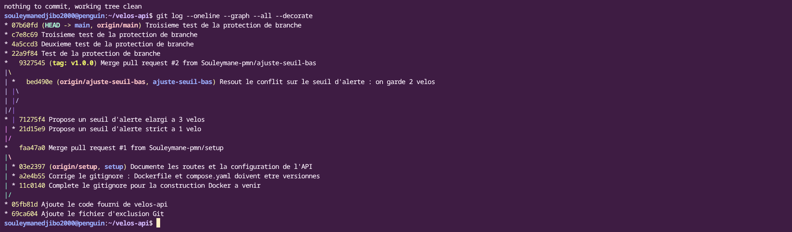
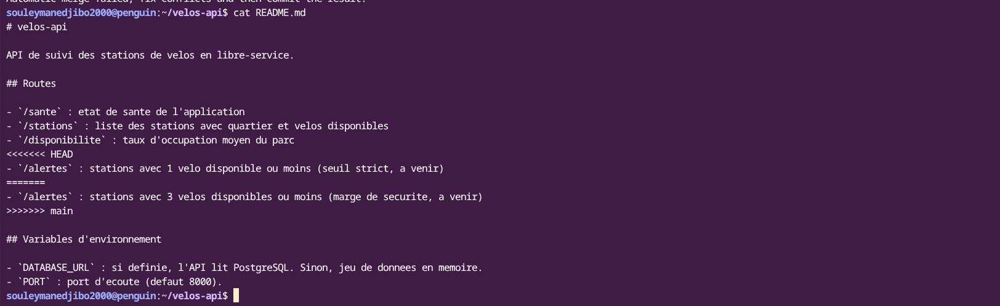
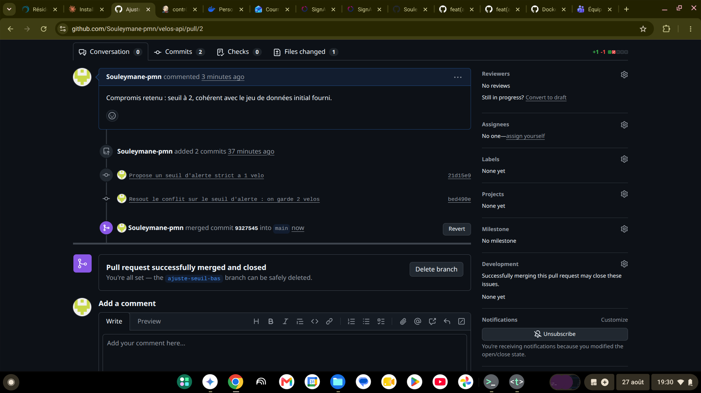
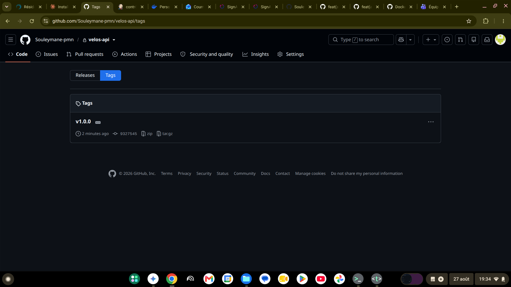
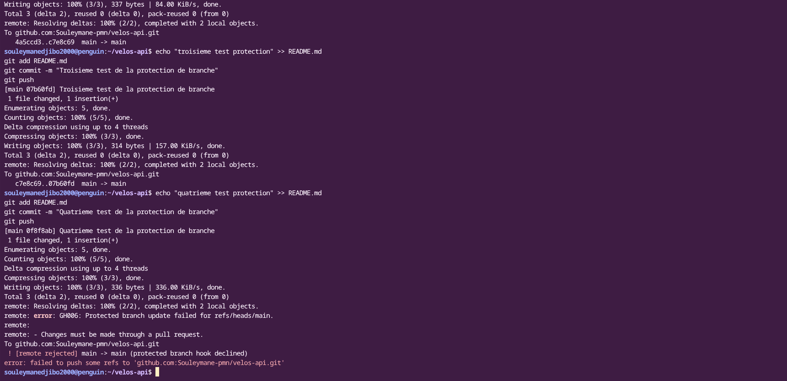

---

## 4. Jalon 2 · Docker

**Mesure du cache de construction**

| Situation | Durée mesurée |
| --- | --- |
| Construction avec les dépendances copiées après le code | 25,7 s (dont ~13 s de réinstallation inutile des dépendances) |
| Construction avec les dépendances installées avant le code | 2,8 s |

**Taille de l'image**

| Version | Taille |
| --- | --- |
| Version naïve, un seul étage | 1,63 Go |
| Version finale, plusieurs étages | 194 Mo |

**Ce que le fichier d'exclusion de construction évite d'envoyer :** `.git`, `.gitignore`, `venv/`, `__pycache__/`, les fichiers `.pyc`, `.env`, ainsi que `Dockerfile`, `compose.yaml` et les fichiers `.md` eux-mêmes — rien de tout cela n'est nécessaire à l'intérieur de l'image, et leur exclusion réduit fortement le contexte envoyé au démon Docker à chaque construction.

**Comment j'ai prouvé la persistance :** j'ai ajouté une station reconnaissable (« Station Test Persistance ») directement dans la base via `psql`, vérifié sa présence par l'API, puis détruit complètement la pile avec `docker compose down` (conteneurs et réseau supprimés, pas seulement arrêtés) avant de la remonter avec `docker compose up -d`. La station était toujours présente après remontée, preuve que la donnée vit dans le volume nommé et non dans les conteneurs.

**Ce que je retiens :** l'ordre des instructions dans un `Dockerfile` a un effet direct et mesurable sur la vitesse de développement (facteur ~9 dans mon cas) ; un conteneur est jetable, mais un volume ne l'est pas — c'est cette distinction qui permet de détruire et recréer librement l'infrastructure sans perdre les données.

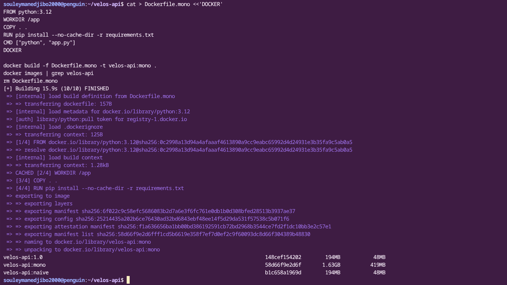
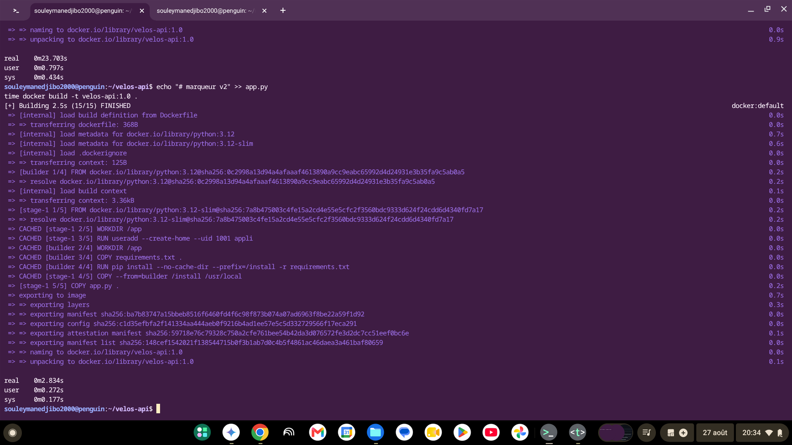
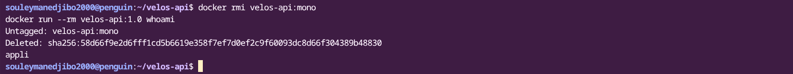
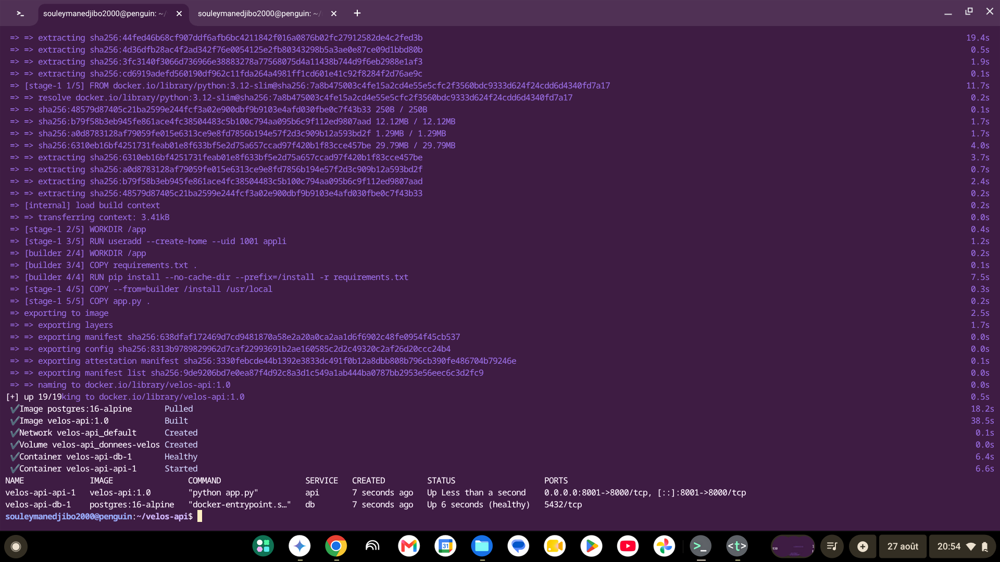
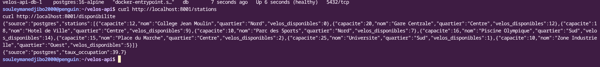
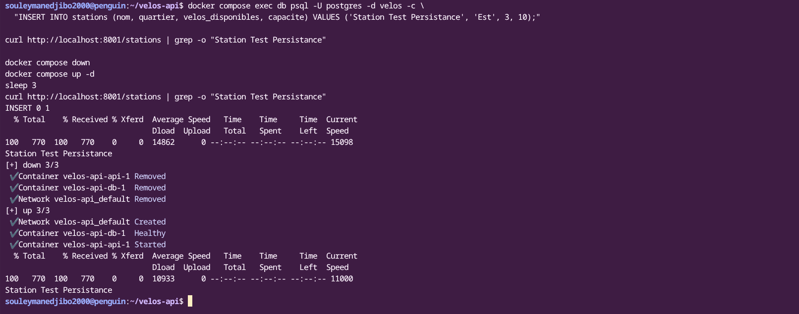

---

## 5. Jalon 3 · Kubernetes

**Comment j'ai obtenu le port 8081 vers le cluster :** le fichier de configuration du cluster (`k8s/kind-cluster.yaml`) déclare un `extraPortMappings` sur le nœud `control-plane`, reliant le port `30081` du conteneur au port `8081` de ma machine. Ce mappage est fixé à la création du cluster : il n'existe pas d'option pour l'ajouter après coup, il faut recréer le cluster avec la bonne configuration dès le départ.

**Où vit le mot de passe, et pourquoi ce n'est pas un coffre-fort :** le mot de passe PostgreSQL vit dans un `Secret` Kubernetes (`velos-secret`), créé directement en ligne de commande sans jamais passer par un fichier commité. Cette ressource n'est cependant pas chiffrée : elle encode simplement la valeur en base64, ce qui la rend instantanément lisible par quiconque a le droit de consulter les secrets du cluster. Un vrai coffre-fort nécessiterait un chiffrement au repos ou un outil externe dédié.

**Ce que j'ai observé en supprimant un exemplaire sous trafic :** une boucle `curl` envoyait une requête toutes les 0,3 seconde vers `/sante` pendant que je supprimais un pod. Le flux de réponses `200` ne s'est jamais interrompu : le déploiement a immédiatement recréé un pod de remplacement, et les exemplaires restants ont continué à répondre.

**La mise à jour vers la version 2 :** pendant le remplacement progressif des quatre exemplaires (1 sur 4, puis 2, puis 3, puis 4), le flux de requêtes `curl` est resté à `200` en continu, entrecoupé des messages de progression du déploiement (`rollout status`). Aucune coupure n'a été observée, contrairement à la suppression brutale et simultanée de tous les pods testée plus tôt, qui avait provoqué quelques réponses en échec.

**Le retour arrière :** `kubectl rollout undo` a ramené le déploiement à la révision précédente en quelques secondes, avec le même mécanisme de remplacement progressif que pour une mise à jour normale.

**Ce que je retiens :** le nombre d'exemplaires déclaré est une promesse que Kubernetes tient en permanence, pas une commande ponctuelle. La mise à jour progressive et le retour arrière reposent sur le même mécanisme de remplacement par lots, ce qui explique pourquoi les deux opérations sont aussi sûres l'une que l'autre.

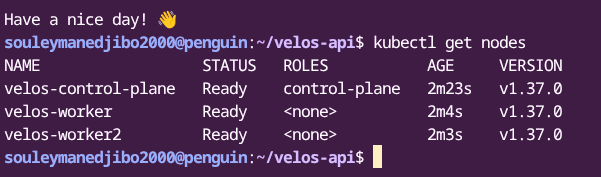
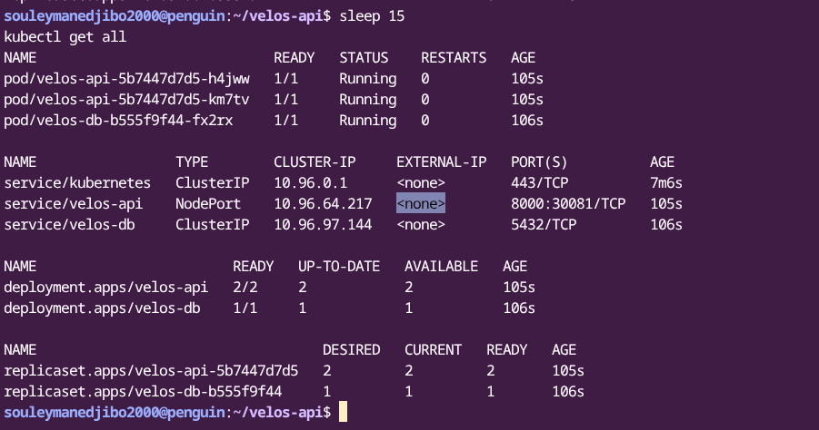
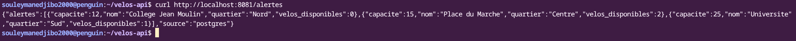
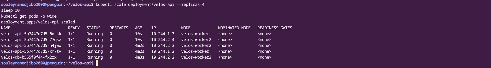
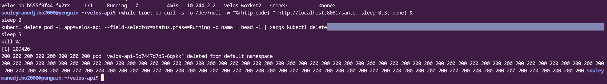
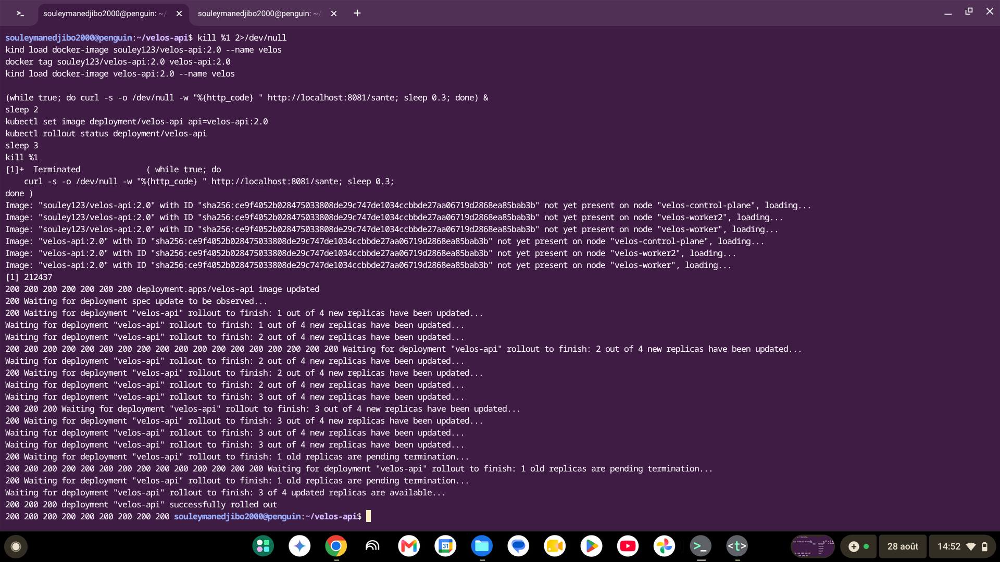
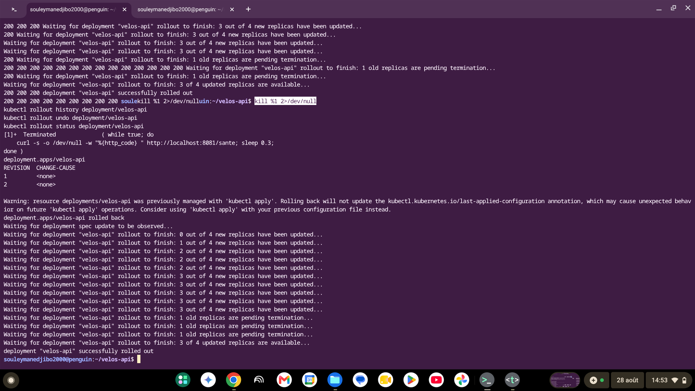

---

## 6. Jalon 4 · Jenkins

**Mes tests :** deux tests automatisés dans `tests/test_app.py`. Le premier vérifie que `/sante` répond `200`. Le second vérifie que `/alertes` renvoie bien `"source": "memoire"` et que toutes les stations retournées ont au maximum 2 vélos disponibles. Ils ne nécessitent aucune base de données car l'application se rabat automatiquement sur son jeu de données en mémoire quand `DATABASE_URL` n'est pas définie — exactement le cas dans l'étage de test de l'image.

**Les quatre étapes de mon pipeline :** Tester (construit l'étage de test du Dockerfile, qui exécute `pytest` et fait échouer le build si un test échoue), Construire (construit l'image finale), Publier (pousse l'image sur Docker Hub via les identifiants Jenkins), Déployer (met à jour l'image du déploiement Kubernetes et attend la fin du déploiement).

**Comment mes images sont étiquetées, et pourquoi :** chaque exécution du pipeline étiquette l'image avec le numéro de build Jenkins (`$BUILD_NUMBER`), en plus de `latest`. Cette étiquette unique permet de relier directement une image publiée à l'exécution précise qui l'a produite, ce que confirme la présence de `souley123/velos-api:9` sur Docker Hub après le build #9.

**La ligne qui rend mon pipeline honnête :** `kubectl rollout status deployment/velos-api --timeout=180s`. Sans cette ligne, `kubectl set image` rendrait immédiatement la main dès que la demande de mise à jour est acceptée, sans jamais vérifier que les nouveaux pods démarrent réellement — le pipeline se déclarerait vert même si le déploiement échouait silencieusement derrière.

**Le rouge utile :** j'ai modifié `tests/test_app.py` pour faire échouer volontairement l'assertion sur la source des données (`"CASSE_VOLONTAIREMENT"` au lieu de `"memoire"`). Le build a échoué dès l'étape Tester (`1 failed, 1 passed`), et les étapes Construire, Publier et Déployer ont toutes été marquées `skipped due to earlier failure(s)` — aucune image n'a été reconstruite ni publiée, et le service resté en place n'a jamais été touché. J'ai ensuite réparé le test, et le pipeline est repassé au vert sur les étapes Tester, Construire et Publier.

**L'extrait de journal qui donne la cause :**

```
def test_alertes_sans_base():
    client = app.test_client()
    donnees = client.get("/alertes").get_json()
>   assert donnees["source"] == "CASSE_VOLONTAIREMENT"
E   AssertionError: assert 'memoire' == 'CASSE_VOLONTAIREMENT'
FAILED tests/test_app.py::test_alertes_sans_base - AssertionError: assert 'me...
1 failed, 1 passed in 0.27s
```

**Ce que je retiens :** placer les tests dans un étage dédié du `Dockerfile` transforme la vérification en condition bloquante de la construction elle-même — impossible d'obtenir une image sans être passé par les tests. Le "rouge utile" n'a de valeur que si l'on prouve aussi que rien n'a été publié ni déployé pendant l'échec, pas seulement que l'étape s'est arrêtée.

**Limite assumée :** le cluster Kubernetes local (`kind`) a dû être supprimé en cours de route pour libérer de l'espace disque (voir difficulté n°1 ci-dessous). L'étape Déployer du pipeline a donc échoué faute de cluster disponible au moment des dernières exécutions, alors que les trois étapes précédentes (Tester, Construire, Publier) fonctionnent parfaitement et de façon reproductible.

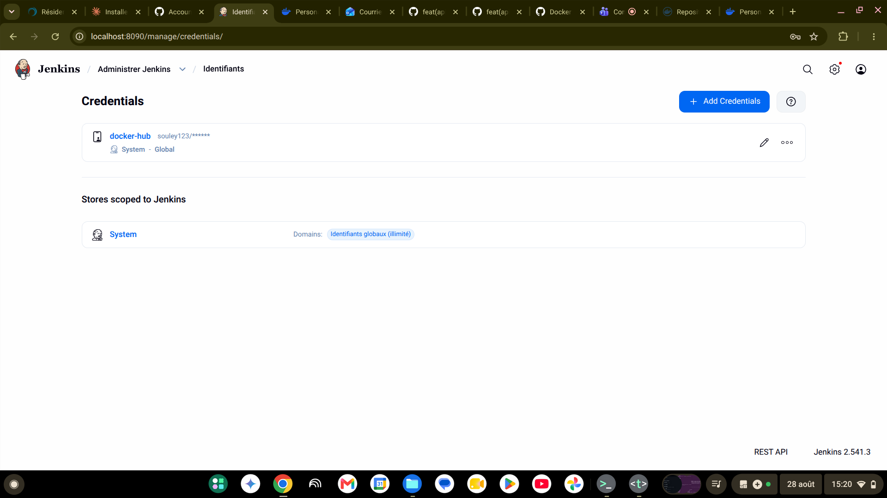
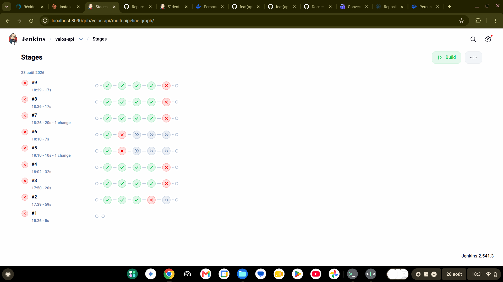
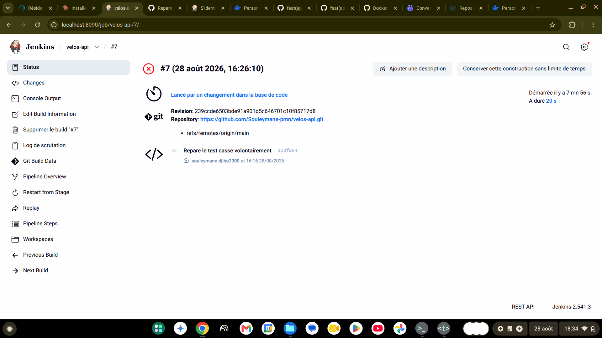
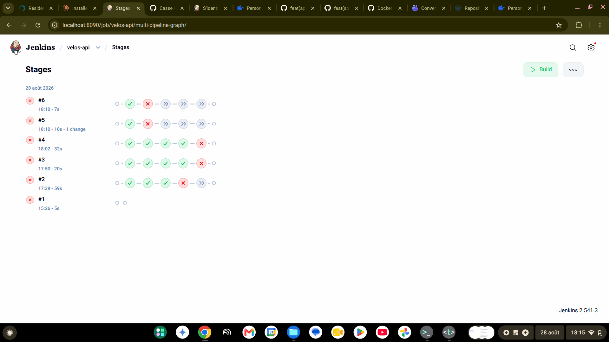
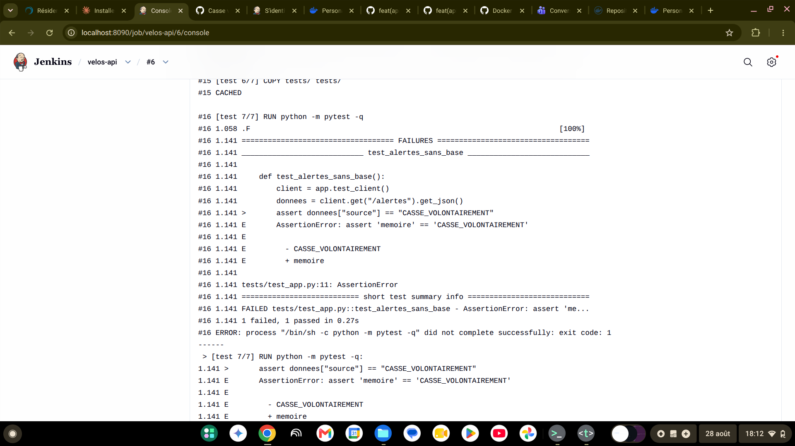
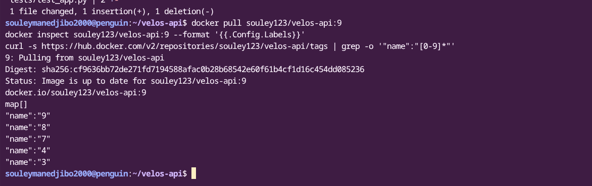

---

## 7. Mes trois difficultés

| # | Symptôme observé | Cause réelle | Correction apportée |
| --- | --- | --- | --- |
| 1 | `no space left on device` à répétition pendant les constructions Docker et le déploiement de la pile | Disque de 10 Go du Chromebook saturé par l'accumulation d'images, de cache de build et du cluster Kubernetes de la veille (`meteo-api`) encore actif | Nettoyage ciblé (`docker builder prune`, `docker system prune`), puis arrêt définitif de Jenkins et du cluster de la veille pour libérer environ 2,7 Go |
| 2 | `authentication required - access token has insufficient scopes` lors de la publication de l'image depuis Jenkins | Le jeton d'accès Docker Hub configuré dans les identifiants Jenkins avait été généré en lecture seule (`Read-only`) au lieu de lecture-écriture | Génération d'un nouveau jeton avec la permission `Read & Write`, mis à jour dans les identifiants Jenkins |
| 3 | Impossible de me reconnecter à Jenkins après une recréation du conteneur (mot de passe administrateur oublié) | Le volume `jenkins_home` conservait un compte déjà créé la veille, donc plus de mot de passe initial à afficher, et je n'avais pas noté mes identifiants | Désactivation temporaire de l'authentification Jenkins via un script Groovy placé dans `init.groovy.d`, acceptable en local pour terminer la démonstration, mais à ne jamais faire sur un Jenkins exposé |

---

## 8. Ce qui n'est pas fait

L'étape **Déployer** du pipeline Jenkins n'a pas pu aboutir sur ses dernières exécutions : le cluster Kubernetes `velos` a été supprimé en cours de projet pour libérer de l'espace disque, et le temps restant n'a pas permis de le recréer puis de reconfigurer le credential `kubeconfig-velos` avant l'échéance. Les captures Kubernetes (C12 à C18) ont toutes été prises avec succès sur ce cluster avant sa suppression, et les trois premières étapes du pipeline (Tester, Construire, Publier) fonctionnent de façon fiable et reproductible, image publiée à l'appui (C24).

Le QCM n'a pas été rempli au moment de la rédaction de ce rapport ; je le complète dans la foulée avant l'échéance.

---

## 9. Assistance utilisée

J'ai utilisé Claude (Anthropic) tout au long du projet comme assistant de guidage : explication des commandes à taper, diagnostic des messages d'erreur (disque plein, jeton Docker Hub insuffisant, protection de branche, mot de passe Jenkins oublié), relecture des résultats de commandes que j'exécutais moi-même dans mon terminal et mon navigateur. Toutes les commandes ont été tapées et exécutées par moi ; les captures d'écran ont été prises par moi au moment demandé. Claude a explicitement refusé de remplir le QCM à ma place, au motif que c'est un exercice individuel destiné à vérifier ma propre compréhension.

---

## 10. Si j'avais deux jours de plus

Je recréerais le cluster Kubernetes et terminerais proprement l'étape Déployer du pipeline Jenkins, avec une preuve complète de bout en bout (build vert à 5/5 étapes). J'ajouterais une sonde de vivacité distincte de la sonde de disponibilité sur le déploiement `velos-api`, ainsi que des limites de ressources sur tous les conteneurs de la pile Docker Compose. J'étiquetterais les images produites par le pipeline avec le condensé du commit Git plutôt qu'avec le seul numéro de build, pour une traçabilité encore plus directe entre le code et l'image en service.
